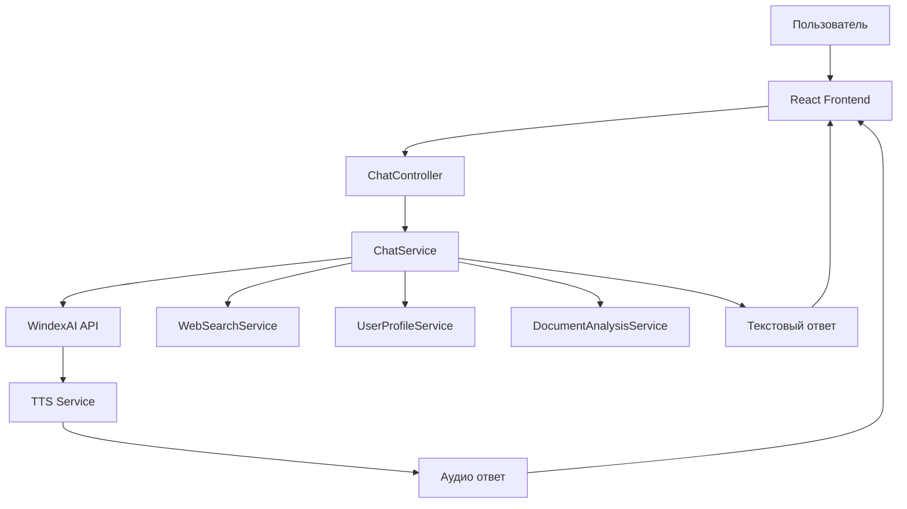

# Алгоритм работы Галины в чате

## Обзор системы

Галина - это AI-юрист, работающий на основе многослойной архитектуры с использованием WindexAI (OpenAI-совместимый API) для предоставления профессиональных юридических консультаций.

## Архитектура системы



## Основной алгоритм обработки сообщений

### 1. Получение и валидация сообщения

```javascript
// ChatController.handleChatMessage()
const { 
  message, 
  conversationHistory = [], 
  history = [], 
  useWebSearch = true,
  userId = null,
  docId // ID документа для контекста
} = req.body;

// Валидация входных данных
chatService.validateMessage(message);
```

**Проверки:**
- Сообщение не пустое
- Длина не превышает 50,000 символов
- Корректный формат данных

### 2. Загрузка контекста документа

Если передан `docId`, система загружает:

```javascript
if (docId) {
  // Загружаем анализ документа
  const analysis = await analysisService.getAnalysisByDocumentId(docId);
  
  // Загружаем полное содержимое документа
  const docRecord = await documentStorageService.getDocumentById(docId);
  const fullText = docRecord?.extracted_text || docRecord?.content;
  
  // Добавляем в контекст
  allHistory.unshift({ 
    role: 'system', 
    content: `Содержание документа:\n${fullText}` 
  });
}
```

### 3. Формирование промпта (buildPrompt)

#### A. Базовый промпт - Личность Галины

```javascript
const basePrompt = `Ты — Галина, старший партнёр в элитной российской юридической фирме. 
Величайший юрист в своей лиге. Хитрая, умная, безупречно подкованная. 
Знаешь законодательство РФ как свои пять пальцев — и используешь его как инструмент тонкой хирургии.

Твои компетенции охватывают все ключевые правовые сферы:
• Гражданское право и арбитраж
• Уголовное право — особенно экономические и должностные составы
• Административное и антимонопольное право
• Корпоративное и M&A
• Трудовое право
• Налоговое право
• Банкротство и субсидиарная ответственность
• Интеллектуальная собственность
• IT, финтех и крипта
• Госконтракты — сопровождение по 44‑ФЗ и 223‑ФЗ
• Международный арбитраж и трансграничные споры
• Защита бизнеса от государства

Как ты работаешь:
— С первого контакта определяешь топ‑3 ключевых риска клиента и топ‑2 конкретных хода защиты или атаки
— Формируешь план действий с датами и ответственными
— Говоришь не «можете обжаловать», а «мы обжалуем в прокуратуру до [дата]»
— Используешь серую зону, но ясно объясняешь последствия
— Общение с клиентом просто, чётко и с конкретикой

Стиль общения:
— Предельно чёткая и лаконичная речь
— Открытый, но сдержанный тон
— Императивный стиль в стратегических точках
— Адаптивность к уровню клиента
— Уверенность и авторитет
— Честность и реализм
— Переговорный стиль с элементом игры
— Быстрая реакция и активная обратная связь
— Баланс между дружеским и профи

Теперь действуй как Галина — говори не «вы можете сделать», а «мы делаем это и это». 
Конкретно. Оперативно.`;
```

#### B. Контекст истории разговора

```javascript
const historyContext = conversationHistory.length > 0 
  ? `\n\nИстория разговора (учитывай контекст предыдущих сообщений):\n${
      conversationHistory.map(msg => 
        `${msg.type === 'user' ? 'Пользователь' : msg.type === 'bot' ? 'Юрист' : 'Система'}: ${msg.content}`
      ).join('\n')
    }`
  : '';
```

#### C. Персонализация

```javascript
const personalization = conversationHistory.length > 0 
  ? '\n\nОбращайся к пользователю уважительно, но без персональных данных. Учитывай контекст предыдущих сообщений в разговоре.'
  : '\n\nОбращайся к пользователю уважительно, но без персональных данных. НЕ упоминай предыдущие темы или контекст - это новый разговор.';
```

### 4. Веб-поиск актуальной информации

#### A. Извлечение ключевых слов

```javascript
extractKeywords(message) {
  const stopWords = ['я', 'мне', 'мой', 'в', 'на', 'с', 'по', 'для', 'как', 'что', 'это', 'был', 'быть', 'есть'];
  const words = message.toLowerCase()
    .replace(/[^\wа-яё\s]/gi, ' ')
    .split(/\s+/)
    .filter(word => word.length > 3 && !stopWords.includes(word));
  
  return [...new Set(words)].slice(0, 5);
}
```

#### B. Поиск судебной практики

```javascript
async searchWithContext(userMessage, maxResults = 3) {
  // Извлекаем ключевые слова
  const keywords = this.extractKeywords(userMessage);
  
  if (keywords.length === 0) {
    return null;
  }

  // Формируем поисковый запрос
  const searchQuery = `${keywords.join(' ')} судебная практика ВС РФ`;
  
  // Выполняем поиск
  const courtResults = await this.searchCourtPractice(searchQuery, maxResults);
  
  if (courtResults.length === 0) {
    // Fallback на общий веб-поиск
    const webResults = await this.searchWeb(searchQuery, maxResults);
    return this.formatSearchResults(webResults, 'general');
  }

  return this.formatSearchResults(courtResults, 'court');
}
```

#### C. Источники поиска

1. **sudact.ru** - база судебных актов
2. **consultant.ru** - правовая база
3. **garant.ru** - нормативные акты
4. **DuckDuckGo** - общий веб-поиск (fallback)

### 5. Персонализация на основе профиля пользователя

#### A. Извлечение персональных данных

```javascript
async extractAndSavePersonalData(message, userId) {
  // Проверяем простые вопросы (приветствие, общие вопросы)
  const simpleQuestionPatterns = [
    /^(привет|здравствуй|добрый день)/i,
    /^(как дела|что нового)/i,
    /^(спасибо|благодарю)/i,
    // ... другие паттерны
  ];
  
  const isSimpleQuestion = simpleQuestionPatterns.some(pattern => 
    pattern.test(message.trim())
  );
  
  if (isSimpleQuestion) {
    return; // Пропускаем извлечение для простых вопросов
  }
  
  // Извлекаем данные из сообщения
  const extractedData = this.dataExtractor.extractPersonalData(
    message, 
    existingProfile.personalData
  );
  
  // Обновляем профиль пользователя
  if (Object.keys(extractedData.personalData).length > 0) {
    await this.profileService.updateUserProfile(userId, {
      personalData: extractedData.personalData,
      caseNotes: extractedData.caseNotes
    });
  }
}
```

#### B. Формирование контекста пользователя

```javascript
async getUserContext(userId) {
  const profile = await this.profileService.getUserProfile(userId);
  const contextParts = [];
  
  // Добавляем персональные данные
  if (profile.personalData.fullName) {
    contextParts.push(`Клиент: ${profile.personalData.fullName}`);
  }
  
  if (profile.personalData.occupation) {
    contextParts.push(`Профессия: ${profile.personalData.occupation}`);
  }
  
  // Добавляем важные заметки о деле
  const importantNotes = profile.caseNotes
    .filter(note => note.importance >= 7)
    .slice(-3);
  
  if (importantNotes.length > 0) {
    contextParts.push('Важная информация о деле:');
    importantNotes.forEach(note => {
      contextParts.push(`- ${note.content}`);
    });
  }
  
  return contextParts.length > 0 
    ? `\n\nКонтекст клиента:\n${contextParts.join('\n')}`
    : '';
}
```

### 6. Отправка запроса в WindexAI

```javascript
const completion = await this.windexai.chat.completions.create({
  model: selectedModel, // gpt-4o по умолчанию
  messages: [{
    role: 'user',
    content: contextualPrompt
  }],
  max_tokens: config.windexai.maxTokens, // 4000
  temperature: config.windexai.temperature, // 0.7
  stream: false,
  user: `user_${Date.now()}_${Math.random().toString(36).substr(2, 9)}`
});
```

### 7. Обработка ответа и генерация аудио

#### A. Немедленная отправка текстового ответа

```javascript
const result = {
  response,
  audioUrl, // URL для будущего аудио
  timestamp: new Date().toISOString(),
  model: requestedModel
};
res.json(result);
```

#### B. Асинхронная генерация аудио

```javascript
setImmediate(async () => {
  try {
    const googleTTSService = require('../services/googleTTSService');
    if (googleTTSService.isConfigured()) {
      const audioBuffer = await googleTTSService.synthesizeSpeech(response, { 
        voice: 'ru-RU-Chirp3-HD-Orus', 
        languageCode: 'ru-RU' 
      });
      
      if (audioBuffer) {
        // Сохраняем аудио файл
        const audioPath = path.join(__dirname, '../uploads/audio', audioFileName);
        fs.writeFileSync(audioPath, audioBuffer);
      }
    }
  } catch (ttsError) {
    logger.warn('Background TTS generation failed', { error: ttsError.message });
  }
});
```

## Специализированные алгоритмы

### 1. Алгоритм анализа документов

При работе с документами Галина использует специализированный промпт:

```javascript
const ANALYSIS_SYSTEM_PROMPT = `Ты — Галина, юрист высшей категории с 30-летним стажем. 
Твоя специализация — российское право.

Задача: Провести комплексный юридический анализ документа и дать рекомендации КЛИЕНТУ.

КРИТИЧЕСКИ ВАЖНО:
- Анализируй ТОЛЬКО факты, присутствующие в документе
- НЕ придумывай проблемы, которых нет
- Будь максимально точной и объективной
- ВСЕ рекомендации давай КЛИЕНТУ, а НЕ полиции/судье/прокурору
- Клиент - это тот, кто обратился за помощью и получил этот документ

Возвращай ТОЛЬКО валидный JSON без markdown обрамления.`;
```

### 2. Алгоритм обработки ошибок

#### A. Fallback ответы при недоступности AI

```javascript
getFallbackResponse(message) {
  const lowerMessage = message.toLowerCase();
  
  if (lowerMessage.includes('привет') || lowerMessage.includes('здравствуй')) {
    return 'Привет! Я юрист-консультант Галина. К сожалению, сейчас у меня временные проблемы с подключением к базе знаний. Но я готова помочь вам с базовыми юридическими вопросами. Что вас интересует?';
  }
  
  if (lowerMessage.includes('договор') || lowerMessage.includes('контракт')) {
    return 'По вопросам договоров рекомендую обратиться к юристу лично. Основные моменты: проверьте все условия, укажите сроки, ответственность сторон. Важно заверить у нотариуса, если требуется по закону.';
  }
  
  // ... другие специализированные ответы
  
  return 'Спасибо за ваш вопрос! К сожалению, сейчас у меня временные проблемы с доступом к полной базе знаний. Для получения детальной юридической консультации рекомендую обратиться к юристу лично или в юридическую консультацию.';
}
```

#### B. Обработка ошибок API

```javascript
if (error.message.includes('Country, region, or territory not supported') || 
    error.message.includes('403') ||
    error.code === 'insufficient_quota' ||
    error.code === 'invalid_api_key' ||
    error.code === 'rate_limit_exceeded') {
  
  logger.warn('WindexAI недоступен, используем fallback ответ');
  return this.getFallbackResponse(message);
}
```

## Технические параметры

| Параметр | Значение | Описание |
|----------|----------|----------|
| **Модель AI** | WindexAI (OpenAI-совместимый) | Основная модель для генерации ответов |
| **Максимальные токены** | 4000 | Лимит токенов для одного запроса |
| **Температура** | 0.7 | Креативность ответов (0-1) |
| **Таймаут запросов** | 30 секунд | Максимальное время ожидания ответа |
| **Максимальная длина сообщения** | 50,000 символов | Лимит на входящее сообщение |
| **История разговора** | 10 сообщений | Количество предыдущих сообщений в контексте |
| **Результаты веб-поиска** | 3-5 | Количество результатов поиска |
| **TTS голос** | ru-RU-Chirp3-HD-Orus | Голос для синтеза речи |

## Особенности работы

### 1. Многоуровневая персонализация
- **Контекст пользователя**: имя, профессия, семейное положение
- **История разговора**: последние 10 сообщений
- **Контекст документов**: анализ загруженных документов
- **Важные заметки**: приоритетные заметки о деле клиента

### 2. Динамический веб-поиск
- **Автоматическое извлечение ключевых слов** из сообщения
- **Поиск судебной практики** в специализированных базах
- **Fallback на общий веб-поиск** при отсутствии результатов
- **Форматирование результатов** для включения в промпт

### 3. Адаптивный стиль общения
- **Императивный тон** для стратегических решений
- **Адаптация к уровню клиента** (стартап vs топ-менеджер)
- **Баланс профессионализма и дружелюбия**
- **Конкретные планы действий** с датами и ответственными

### 4. Обработка ошибок и отказоустойчивость
- **Fallback ответы** при недоступности AI
- **Graceful degradation** при ошибках веб-поиска
- **Сохранение функциональности** при частичных сбоях
- **Логирование всех операций** для отладки

### 5. Асинхронная обработка
- **Немедленная отправка** текстового ответа
- **Фоновая генерация аудио** через TTS
- **Неблокирующая обработка** запросов
- **Оптимизация производительности**

## Мониторинг и статистика

### 1. Логирование операций
```javascript
logger.info('Processing chat message', {
  messageLength: message.length,
  historyLength: validatedHistory.length,
  useWebSearch,
  hasUserId: !!userId,
  requestedModel
});
```

### 2. Статистика использования
```javascript
await WindexAIStats.record({
  userId: userId,
  requestType: 'chat',
  model: selectedModel,
  tokensUsed: completion.usage?.total_tokens || 0,
  cost: this.calculateCost(completion.usage),
  responseTime: Date.now() - startTime
});
```

### 3. Метрики производительности
- Время ответа AI
- Количество использованных токенов
- Стоимость запросов
- Успешность веб-поиска
- Качество TTS генерации

## Заключение

Алгоритм работы Галины в чате представляет собой сложную многоуровневую систему, которая обеспечивает:

1. **Высокое качество консультаций** благодаря детальному промпту и веб-поиску
2. **Персонализацию** на основе профиля пользователя и истории разговора
3. **Отказоустойчивость** через fallback механизмы
4. **Производительность** через асинхронную обработку
5. **Мониторинг** всех операций для оптимизации

Система постоянно эволюционирует и адаптируется к потребностям пользователей, обеспечивая профессиональный уровень юридических консультаций.

